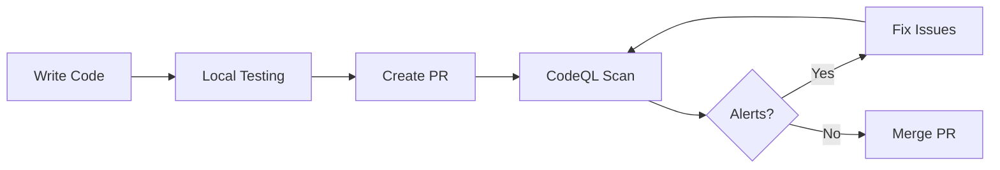

# CodeQL Quick Reference Guide

## 🚀 Quick Start

### First Time Setup

1. **Enable Advanced CodeQL**
   ```
   Settings → Security → Code Security → Code scanning → Switch to Advanced
   ```

2. **Verify Workflow**
   - Check `.github/workflows/codeql.yml` exists
   - Commit and push if needed

3. **Run First Scan**
   - Go to Actions tab
   - Select "CodeQL Security Analysis"
   - Click "Run workflow" → "Run workflow"

4. **View Results**
   - Security tab → Code scanning
   - Review any alerts

---

## 📊 Understanding Results

### Alert Severity Levels

| Level | Description | Action Required |
|-------|-------------|-----------------|
| 🔴 **Critical** | Exploitable vulnerabilities | Fix immediately |
| 🟠 **High** | Serious security issues | Fix within 7 days |
| 🟡 **Medium** | Moderate security concerns | Fix within 30 days |
| 🟢 **Low** | Minor issues, best practices | Fix when convenient |

### Common Alert Types

#### 1. SQL Injection
```typescript
// ❌ Vulnerable
const query = `SELECT * FROM users WHERE id = ${userId}`;

// ✅ Fixed
const query = 'SELECT * FROM users WHERE id = ?';
db.query(query, [userId]);
```

#### 2. Cross-Site Scripting (XSS)
```typescript
// ❌ Vulnerable
element.innerHTML = userInput;

// ✅ Fixed
element.textContent = userInput;
// Or use React's JSX (auto-escapes)
<div>{userInput}</div>
```

#### 3. Path Traversal
```typescript
// ❌ Vulnerable
const filePath = path.join('/files', req.params.filename);

// ✅ Fixed
const filePath = path.join('/files', path.basename(req.params.filename));
```

#### 4. Hardcoded Secrets
```typescript
// ❌ Vulnerable
const apiKey = "sk_live_abc123";

// ✅ Fixed
const apiKey = process.env.API_KEY;
```

---

## 🛠️ Common Operations

### Manual Scan

Trigger a scan manually:

```bash
# Using GitHub CLI
gh workflow run codeql.yml

# Or via web interface
# Actions → CodeQL Security Analysis → Run workflow
```

### View Scan History

```bash
# List recent workflow runs
gh run list --workflow=codeql.yml --limit 10

# View specific run
gh run view <run-id>
```

### Download Results

```bash
# Download SARIF file
gh run download <run-id> --name codeql-results-javascript-typescript
```

---

## 🔍 Analyzing Alerts

### Step-by-Step Alert Review

1. **Open Alert**
   - Go to Security → Code scanning
   - Click on the alert

2. **Understand the Issue**
   - Read the description
   - Review the data flow visualization
   - Check "Show paths" for execution flow

3. **Assess Impact**
   - Can it be exploited?
   - What data is at risk?
   - What's the attack vector?

4. **Plan Fix**
   - Identify root cause
   - Choose remediation strategy
   - Consider breaking changes

5. **Implement Fix**
   - Write secure code
   - Add tests
   - Commit changes

6. **Verify Fix**
   - Wait for next scan
   - Or trigger manual scan
   - Confirm alert is resolved

### Alert Actions

**Dismiss Alert:**
```
1. Open alert
2. Click "Dismiss alert"
3. Select reason:
   - False positive
   - Won't fix
   - Used in tests
4. Add comment explaining decision
```

**Reopen Alert:**
```
Security → Code scanning → Closed → Find alert → Reopen
```

---

## 🎯 Best Practices

### Development Workflow



### Security Checklist

Before merging code:

- [ ] CodeQL scan completed successfully
- [ ] No new high/critical alerts
- [ ] Existing alerts reviewed and addressed
- [ ] Security-sensitive changes peer-reviewed
- [ ] Tests cover security-critical paths

### Code Review Focus Areas

When reviewing PRs:

1. **Input Validation**
   - Are user inputs sanitized?
   - Are there SQL injection risks?
   - Is XSS prevention in place?

2. **Authentication/Authorization**
   - Are permissions checked?
   - Is authentication required?
   - Are tokens handled securely?

3. **Data Protection**
   - Is sensitive data encrypted?
   - Are secrets in environment variables?
   - Is PII handled correctly?

4. **Error Handling**
   - Do errors leak information?
   - Are exceptions caught properly?
   - Is logging secure?

---

## 🔧 Configuration

### Adjusting Scan Scope

**Exclude Paths:**
```yaml
# In codeql.yml
config: |
  paths-ignore:
    - node_modules
    - dist
    - '**/*.test.ts'
    - vendor
```

**Include Only Specific Paths:**
```yaml
config: |
  paths:
    - src
    - lib
```

### Custom Queries

Add organization-specific checks:

```yaml
- name: Initialize CodeQL
  uses: github/codeql-action/init@v4
  with:
    queries: security-and-quality, ./custom-queries
```

Create `custom-queries/custom.ql`:
```ql
/**
 * @name Custom security check
 * @description Detects specific security pattern
 * @kind problem
 * @problem.severity warning
 * @id js/custom-check
 */

import javascript

from CallExpr call
where call.getCalleeName() = "dangerousFunction"
select call, "Avoid using dangerousFunction"
```

---

## 📈 Metrics & Reporting

### Track Security Posture

Monitor these metrics:

1. **Total Alerts**: Trending up or down?
2. **Time to Fix**: How long to resolve alerts?
3. **False Positive Rate**: Are dismissals justified?
4. **Coverage**: All critical paths scanned?

### Generate Reports

```bash
# Export alerts as JSON
gh api repos/:owner/:repo/code-scanning/alerts \
  --jq '.[] | {number, rule_id, severity, state}' \
  > security-report.json
```

### Dashboard Integration

For teams, consider:
- GitHub Security Overview (Organizations)
- Custom dashboards with GitHub API
- Third-party security platforms

---

## 🚨 Incident Response

### If Critical Alert Found

1. **Assess Immediately**
   - Is it exploitable?
   - Is production affected?
   - What's the exposure window?

2. **Contain**
   - Disable vulnerable feature if needed
   - Monitor for exploitation attempts
   - Alert security team

3. **Fix**
   - Create hotfix branch
   - Implement secure solution
   - Test thoroughly

4. **Deploy**
   - Fast-track through CI/CD
   - Deploy to production
   - Verify fix

5. **Review**
   - Post-mortem analysis
   - Update security guidelines
   - Improve detection

---

## 🎓 Learning Resources

### Tutorials

1. **CodeQL Academy**
   - https://codeql.github.com/docs/writing-codeql-queries/
   - Interactive query writing tutorials

2. **Security Lab**
   - https://securitylab.github.com/
   - Real-world vulnerability research

3. **OWASP Top 10**
   - https://owasp.org/www-project-top-ten/
   - Common web vulnerabilities

### Practice

**CTF Challenges:**
- https://github.com/WebGoat/WebGoat
- https://owasp.org/www-project-juice-shop/

**Sample Vulnerable Code:**
```typescript
// Challenge: Find and fix 5 vulnerabilities
import express from 'express';
const app = express();

app.get('/user/:id', (req, res) => {
  const userId = req.params.id;
  const query = `SELECT * FROM users WHERE id = ${userId}`;
  
  db.query(query, (err, results) => {
    if (err) {
      res.send(`Error: ${err.message}`);
    } else {
      res.send(results[0]);
    }
  });
});

app.post('/upload', (req, res) => {
  const filename = req.body.filename;
  const data = req.body.data;
  fs.writeFileSync(`./uploads/${filename}`, data);
  res.send('File uploaded');
});
```

<details>
<summary>Click to see vulnerabilities</summary>

1. **SQL Injection** in user ID query
2. **Error message leakage** exposing database info
3. **Path traversal** in file upload
4. **Missing authentication** on endpoints
5. **No input validation** on filename/data
</details>

---

## 🤝 Getting Help

### Support Channels

1. **Documentation**: Check workflow README first
2. **Logs**: Review Actions logs for errors
3. **Community**: GitHub Discussions
4. **Team**: Internal security team
5. **Support**: GitHub Support (for license issues)

### Common Questions

**Q: Why is my scan taking so long?**
A: Large codebases need more time. Consider increasing timeout or using larger runners.

**Q: Can I scan specific files only?**
A: Use path filters in workflow triggers or CodeQL config.

**Q: How do I test queries locally?**
A: Install CodeQL CLI: https://github.com/github/codeql-cli-binaries

**Q: Are there costs?**
A: Free for public repos. Private repos need GitHub Advanced Security.

**Q: Can I integrate with other tools?**
A: Yes, export SARIF and import to security platforms.

---

**Quick Links:**
- [Full Documentation](./workflows/README.md)
- [Workflow File](./workflows/codeql.yml)
- [GitHub CodeQL Docs](https://docs.github.com/en/code-security/code-scanning)
- [Report Security Issue](../SECURITY.md)

---

*Version 2.0.0 | Last Updated: 2025-10-29*
