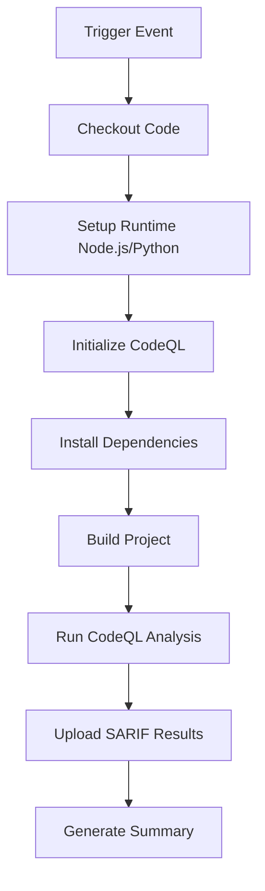

# GitHub Actions Workflows Documentation

This directory contains automated workflows for the Fit Pathway Organizer project.

## 📋 Table of Contents

- [CodeQL Security Analysis](#codeql-security-analysis)
- [Workflow Maintenance](#workflow-maintenance)
- [Troubleshooting](#troubleshooting)

---

## 🔒 CodeQL Security Analysis

**File:** `codeql.yml`  
**Purpose:** Automated security vulnerability detection and code quality analysis

### Features

The CodeQL workflow is configured with state-of-the-art security practices:

#### 🎯 Core Capabilities
- **Multi-Language Analysis**: Scans JavaScript/TypeScript and Python code
- **Vulnerability Detection**: Identifies security issues, bugs, and code quality problems
- **Scheduled Scans**: Runs weekly (Sundays at midnight UTC) for continuous monitoring
- **Pull Request Integration**: Automatically scans PR changes before merge
- **Manual Dispatch**: Can be triggered on-demand from Actions tab

#### ⚡ Performance Features
- **Dependency Caching**: Caches npm and pip packages for faster runs
- **Parallel Execution**: Uses matrix strategy to scan languages simultaneously
- **Smart Cancellation**: Cancels duplicate runs when new commits are pushed
- **Optimized Paths**: Skips unnecessary files (docs, markdown, etc.)

#### 🔐 Security Hardening
- **Minimal Permissions**: Uses principle of least privilege
- **Enhanced Query Suite**: Runs `security-and-quality` queries for comprehensive coverage
- **Test Exclusion**: Excludes test files to focus on production code
- **SARIF Backup**: Archives results for 30 days for audit trails

### Setup Instructions

#### Prerequisites

Before the workflow can run successfully, you **must** enable Advanced CodeQL setup:

1. Navigate to your repository on GitHub
2. Go to **Settings** → **Security** → **Code Security and Analysis**
3. Locate the **"Code scanning"** section
4. If using Default setup, click **"Switch to Advanced"**
5. Confirm the switch

> ⚠️ **Important**: The workflow will fail with SARIF upload errors if Default setup is still active. GitHub blocks SARIF uploads from custom workflows when Default setup is enabled.

#### Configuration

The workflow is pre-configured for this project but can be customized:

**Supported Languages:**
```yaml
matrix:
  include:
    - language: javascript-typescript  # React/Vite app
    - language: python                 # Backend scripts
```

**Build Commands:**
```yaml
- npm ci                    # Clean install dependencies
- npm run build            # TypeScript + Vite build
```

**Triggers:**
- Push to `main`, `master`, or `develop` branches
- Pull requests to main branches
- Weekly schedule (Sundays 00:00 UTC)
- Manual dispatch

### How It Works



**Step-by-Step Process:**

1. **Checkout**: Fetches full repository history for better analysis
2. **Setup Runtime**: Configures Node.js 20 and Python 3.11 with caching
3. **Initialize CodeQL**: Prepares security scanning with query suite
4. **Install Dependencies**: Runs `npm ci` for JavaScript, `pip install` for Python
5. **Build**: Compiles TypeScript application with `npm run build`
6. **Analysis**: Scans code for vulnerabilities and quality issues
7. **Upload**: Sends SARIF results to GitHub Security tab
8. **Summary**: Generates workflow summary with links to findings

### Viewing Results

After a scan completes:

1. Navigate to your repository's **Security** tab
2. Click **"Code scanning"** in the left sidebar
3. Review any alerts or findings
4. Click on an alert to see:
   - Vulnerability description
   - Affected code location
   - Remediation guidance
   - Severity level

### Customization Guide

#### Adding New Languages

To scan additional languages:

```yaml
matrix:
  include:
    - language: javascript-typescript
      build-mode: manual
      node-version: '20'
    
    - language: python
      build-mode: none
      python-version: '3.11'
    
    # Add new language here
    - language: go
      build-mode: autobuild
      go-version: '1.21'
```

**Supported Languages:**
- `actions` (GitHub Actions)
- `c-cpp` (C/C++)
- `csharp` (C#)
- `go` (Go)
- `java-kotlin` (Java/Kotlin)
- `javascript-typescript` (JavaScript/TypeScript)
- `python` (Python)
- `ruby` (Ruby)
- `rust` (Rust)
- `swift` (Swift)

#### Changing Query Suites

Adjust the security query level:

```yaml
# Option 1: Default (fewer false positives)
queries: default

# Option 2: Security Extended (recommended)
queries: security-extended

# Option 3: Security + Quality (most comprehensive)
queries: security-and-quality
```

#### Modifying Build Commands

Update build steps for your project:

```yaml
- name: Build TypeScript/React application
  if: matrix.language == 'javascript-typescript'
  run: |
    npm run build:prod          # Custom build script
    npm run lint               # Add linting
    npm run test:unit          # Run unit tests
```

#### Adjusting Scan Frequency

Change the cron schedule:

```yaml
schedule:
  - cron: '0 0 * * 0'    # Weekly (Sundays at midnight)
  # - cron: '0 0 * * *'  # Daily at midnight
  # - cron: '0 */6 * * *' # Every 6 hours
  # - cron: '0 9 * * 1'  # Mondays at 9 AM
```

### Performance Tuning

#### For Large Codebases

Increase analysis resources:

```yaml
- name: Perform CodeQL Analysis
  uses: github/codeql-action/analyze@v4
  with:
    ram: 16000              # Increase RAM (default: 6000)
    threads: 4              # Use more CPU cores
```

#### For Faster Builds

Optimize dependency installation:

```yaml
- name: Install Node.js dependencies
  run: |
    npm ci --prefer-offline --no-audit --ignore-scripts
```

#### For Monorepos

Add path filtering:

```yaml
on:
  push:
    paths:
      - 'apps/frontend/**'
      - 'packages/shared/**'
      - 'package.json'
```

---

## 🔧 Workflow Maintenance

### Regular Updates

Keep workflows up to date:

1. **Action Versions**: Check for updates quarterly
   ```bash
   # Check for new versions
   gh api repos/github/codeql-action/releases/latest
   ```

2. **Node.js Version**: Align with project requirements
   ```yaml
   node-version: '20'  # Update as needed
   ```

3. **Query Suites**: Review new security queries from GitHub

### Best Practices

✅ **Do:**
- Run CodeQL on every PR
- Review security findings promptly
- Keep action versions updated
- Use dependency caching
- Enable scheduled scans

❌ **Don't:**
- Skip security findings without review
- Disable scans to pass CI faster
- Remove test exclusions without justification
- Use outdated action versions

### Security Checklist

- [ ] Advanced CodeQL setup is enabled
- [ ] Workflow runs on all main branches
- [ ] Security findings are reviewed within 7 days
- [ ] Critical vulnerabilities are fixed immediately
- [ ] Action versions are up to date
- [ ] Permissions follow least privilege principle

---

## 🐛 Troubleshooting

### Common Issues

#### 1. SARIF Upload Errors

**Error:** `Advanced Security must be enabled for this repository to use code scanning`

**Solution:**
1. Enable GitHub Advanced Security (for private repos)
2. Or switch from Default to Advanced CodeQL setup
3. Check Settings → Security → Code security

#### 2. Build Failures

**Error:** `npm ERR! missing script: build`

**Solution:**
- Ensure `package.json` has a build script
- Or update workflow to skip build if not needed:
  ```yaml
  - name: Build project
    if: matrix.language == 'javascript-typescript'
    run: |
      if grep -q '"build"' package.json; then
        npm run build
      fi
  ```

#### 3. Out of Memory Errors

**Error:** `JavaScript heap out of memory`

**Solution:**
- Increase Node.js memory:
  ```yaml
  - name: Build project
    run: NODE_OPTIONS="--max-old-space-size=8192" npm run build
  ```

#### 4. Timeout Issues

**Error:** `The job running on runner ... has exceeded the maximum execution time`

**Solution:**
- Increase timeout:
  ```yaml
  jobs:
    analyze:
      timeout-minutes: 360  # Increase as needed
  ```

#### 5. Dependency Installation Failures

**Error:** `npm ERR! code EINTEGRITY`

**Solution:**
- Clear package lock and reinstall:
  ```yaml
  - name: Install dependencies
    run: |
      rm -rf node_modules package-lock.json
      npm install
  ```

### Getting Help

If you encounter issues not covered here:

1. **Check Workflow Logs**: Actions tab → Select failed run → View logs
2. **GitHub Docs**: [CodeQL Documentation](https://docs.github.com/en/code-security/code-scanning)
3. **Community**: [GitHub Community Discussions](https://github.com/orgs/community/discussions)
4. **Support**: [GitHub Support](https://support.github.com)

### Debugging Tips

Enable debug logging:

1. Go to repository Settings → Secrets and variables → Actions
2. Add secret: `ACTIONS_STEP_DEBUG` = `true`
3. Add secret: `ACTIONS_RUNNER_DEBUG` = `true`
4. Re-run the workflow

View detailed logs in the Actions tab.

---

## 📚 Additional Resources

### Official Documentation
- [CodeQL Overview](https://codeql.github.com/docs/)
- [CodeQL Query Help](https://codeql.github.com/codeql-query-help/)
- [GitHub Advanced Security](https://docs.github.com/en/get-started/learning-about-github/about-github-advanced-security)

### Best Practices
- [Secure Software Development](https://docs.github.com/en/code-security/getting-started/securing-your-organization)
- [Dependency Management](https://docs.github.com/en/code-security/supply-chain-security)
- [Secret Scanning](https://docs.github.com/en/code-security/secret-scanning)

### Community Resources
- [Awesome CodeQL](https://github.com/topics/codeql)
- [Security Lab](https://securitylab.github.com/)

---

**Last Updated:** 2025-10-29  
**Maintainer:** Development Team  
**Version:** 2.0.0
